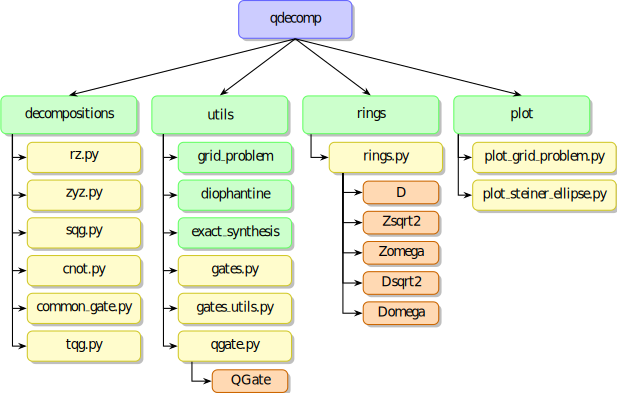

# QDecomp
`QDecomp` is a standalone software package to perform multiple decompositions of single qubit and two-qubit quantum gates.

The package primarily focuses on decomposing gates into the Clifford+T universal subset by implementing the algorithm proposed by Ross and Selinger [[1]](#ref1).

This package was made in collaboration with D-Wave and Polytechnique Montréal.

The package contains 4 main subpackages:
* **decompositions** : Proposes user-oriented functions for decomposing various quantum gates
* **utils** : Contains the core algorithms and additional utility functions
* **rings** : Implements classes for symbolic calculations in mathematical rings
* **plot** : Offers visualization tools of core parts of the algorithm used mainly for debugging

Below is a figure illustrating the subpackages (green) and their associated modules (yellow) and classes (orange). 



## Documentation

Complete API documentation is available and can be built locally using Sphinx:

```bash
cd docs
make html  # On Windows: make.bat html
```

The documentation is generated in `docs/build/html/`. Open `docs/build/html/index.html` in a browser to view it.


## Installation

To install `QDecomp`, clone the repository and install the dependencies:

```bash
git clone https://github.com/polyquantique/QDecomp.git
pip install -r requirements.txt
```

## Usage Examples

### Example #1: Single-Qubit Gate Decomposition

This example demonstrates the use of the `qdcomp.decompositions.sqg_decomp` function to decompose single-qubit gates (SQG) into the Clifford+T universal subset up to a tolerance error $\varepsilon$. Note that the algorithm guarantees the specified error only for $R_z$ gates, meaning the total error for SQG may exceed the user-defined tolerance due to error propagation.   

```pycon
>>> from qdecomp.decompositions import sqg_decomp
>>> import numpy as np
>>> U = np.array([ # Unitary matrix
...     [0.5 + 0.5j, -0.5 - 0.5j],
...     [-0.498 + 0.502, -0.498 + 0.502]
... ])
>>> sequence = sqg_decomp(U, epsilon=1e-2)
>>> print(sequence)
Z H S H S T H T H S T H T H S T H T H S T H T H S T H T H S T H T H T H T H T H T H T H S T H S T H S T H T H T H T H S T H T H Z S H S T H Z
```

### Example #2: Two-Qubit Gate Decomposition
This example demonstrates the use of the `qdecomp.decompositions.tqg_decomp` function to decompose two-qubit gates (TQG) into the Clifford+T universal subset up to a tolerance error $\varepsilon$. The function outputs a `list` of `QGate` objects representing the circuit. The target qubits and the corresponding sequence can be accessed through the `QGate.target` and `QGate.sequence` properties respectively.

```pycon
>>> from qdecomp.decompositions import tqg_decomp
>>> import numpy as np
>>> U = np.array([ # Unitary matrix
...     [ 0.250 + 0.604j , -0.104 - 0.250j , 0.250 + 0.604j , -0.104 - 0.250j ],
...     [ -0.104 - 0.250j , 0.250 + 0.604j , -0.104 - 0.250j , 0.250 + 0.604j ],
...     [ 0.104 + 0.250j , 0.250 + 0.604j , 0.104 + 0.250j , 0.250 + 0.604j ],
...     [ -0.104 - 0.250j , -0.250 - 0.604j , -0.104 - 0.250j , -0.250 - 0.604j ]
... ])
>>> circuit = tqg_decomp(U, epsilon=1e-2) # List of QGate objects
>>> for gate in circuit:
...     print(f"{gate.target} -> {gate.sequence}")
...
(0 ,) -> S
(1 ,) -> S H S H S H S S S H
(0 , 1) -> CNOT CNOT1
(0 ,) -> T
(1 ,) -> H S H
(0 , 1) -> CNOT1
(1 ,) -> H S H Z S H S S S H Z S
(0 ,) -> Z S
```

## License

Released under the Apache License 2.0. See [LICENSE](LICENSE) file.

## Contributors

This project was made possible by:

- Olivier Romain
- Vincent Girouard
- Marius Trudeau
- Francis Blais

Special thanks to the two supervisors of the project:
- Theodor Isacsson
- Nicolás Quesada

## Citing this package

If you use `QDecomp` in your research or projects, please cite it using the following BibTeX entry:

```bibtex
@software{qdecomp,
  author = {Romain, Olivier and Girouard, Vincent and Trudeau, Marius and Blais, Francis},
  title = {QDecomp},
  year = {2025},
  version = {0.1.0},
  url = {https://github.com/polyquantique/QDecomp}
}
```

## References

* <a id="ref1"></a> [1] N. J. Ross and P. Selinger, *Optimal ancilla-free Clifford+T approximation of z-rotations*, 2014. [https://arxiv.org/abs/1403.2975](https://arxiv.org/abs/1403.2975)

* [2] V. Kliuchnikov, D. Maslov, and M. Mosca, *Fast and efficient exact synthesis of single qubit unitaries generated by Clifford and T gates*, 2012. [https://arxiv.org/abs/1206.5538](https://arxiv.org/abs/1206.5538)

* [3] G. E. Crooks, *Quantum gates*, March 2024, version 0.11.0, [https://threeplusone.com/pubs/on_gates.pdf](https://threeplusone.com/pubs/on_gates.pdf)
